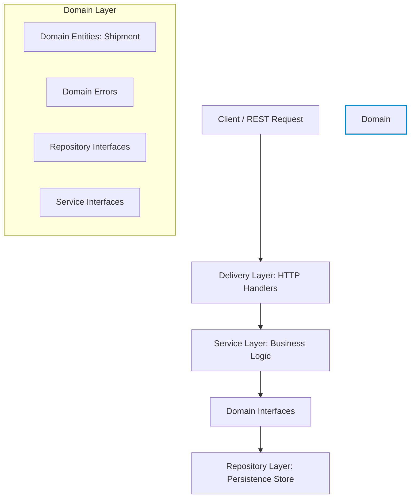

# Multi-Carrier Shipping Golang Microservice

A production-ready, high-performance Go microservice designed using Clean (Hexagonal) Architecture principles. This project implements modern Go standards including Go 1.22+ enhanced HTTP routing, structured logging using `log/slog`, environment-based configuration, and fully-containerized local development.

---

## 🏗️ Architecture Design

This service enforces strict Clean Architecture principles to keep business logic completely decoupled from external frameworks, HTTP delivery details, and database drivers.



- **Domain Layer (`internal/domain`)**: Contains pure business objects (`Shipment`) and interface contracts. It has absolutely zero external dependencies.
- **Repository Layer (`internal/repository`)**: Handles persistence. Includes a thread-safe, in-memory implementation (`MemoryShipmentRepository`) that can be seamlessly swapped for a SQL-based database later.
- **Service Layer (`internal/service`)**: Implements business rules and validation (e.g., carrier requirements, package dimensions, weights).
- **Delivery Layer (`internal/handler`)**: Contains the HTTP transport details. Maps JSON bodies to domain structures and translates domain-specific errors to standard HTTP status codes.

---

## 📂 Project Directory Structure

```text
multi-carrier-shipping-golang/
├── cmd/
│   └── server/
│       └── main.go                  # Main entry point (initializes config, logger, DB, repositories, services, handlers, and starts server)
├── internal/
│   ├── config/
│   │   └── config.go                # Configuration loading from environment variables with defaults
│   ├── domain/
│   │   ├── shipment.go              # Core Shipment domain model and interface definitions
│   │   └── errors.go                # Domain-specific errors
│   ├── repository/
│   │   └── memory_shipment.go       # In-memory implementation of the ShipmentRepository (ready for database replacement)
│   ├── service/
│   │   └── shipment_service.go      # Business logic orchestration for shipments
│   └── handler/
│       ├── http/
│       │   ├── shipment_handler.go  # HTTP handlers for shipments (parsing request, invoking service, writing JSON response)
│       │   └── router.go            # Registering endpoints using net/http Go 1.22 routing
│       └── middleware/
│           └── logging.go           # Basic HTTP request logging middleware using slog
├── go.mod                           # Go modules file (module definition)
├── Dockerfile                       # Multi-stage production build
├── docker-compose.yml               # Local environment definition (app + db)
├── Makefile                         # Task runner for local development
└── README.md                        # This project documentation file
```

---

## 🛠️ Getting Started & Commands

This project includes a handy `Makefile` for developer workflow speed and efficiency:

- **Format Go files**:
  ```bash
  make fmt
  ```
- **Static analyzer checking**:
  ```bash
  make vet
  ```
- **Run automated test suite**:
  ```bash
  make test
  ```
- **Build release binary**:
  ```bash
  make build
  ```
- **Run service locally**:
  ```bash
  make run
  ```
- **Clean build binaries**:
  ```bash
  make clean
  ```

---

## 🐳 Docker Stack

Run the entire microservice stack (Go API + PostgreSQL backend) using Docker Compose:

```bash
docker-compose up --build
```

- **Production-grade Multi-stage Dockerfile**: Builds the Go binary in a small Alpine building container, then copies it to a minimal, lightweight Alpine production image running under a non-root system user (`appuser`) for enhanced security.
- **Docker Compose Setup**: Pre-configured with a PostgreSQL instance including automated health checks to ensure DB readiness before booting the application.

---

## 📡 REST API Specifications

### 1. Health Status Check
- **Endpoint**: `GET /health`
- **Response**: `200 OK`
  ```json
  {
    "status": "UP"
  }
  ```

### 2. Create Shipment
- **Endpoint**: `POST /api/v1/shipments`
- **Request Body**:
  ```json
  {
    "carrier": "FedEx",
    "tracking_number": "TRK-100293",
    "weight": 14.8,
    "origin": "New York",
    "destination": "Los Angeles"
  }
  ```
- **Response**: `201 Created`
  ```json
  {
    "id": "7063a6e9-ee76-4b20-a541-fa6413054edc",
    "carrier": "FedEx",
    "tracking_number": "TRK-100293",
    "weight": 14.8,
    "origin": "New York",
    "destination": "Los Angeles",
    "status": "CREATED",
    "created_at": "2026-05-20T12:02:58.415929+05:30",
    "updated_at": "2026-05-20T12:02:58.415929+05:30"
  }
  ```

### 3. Get Shipment by ID
- **Endpoint**: `GET /api/v1/shipments/{id}`
- **Response**: `200 OK` (Or `404 Not Found` if missing)
  ```json
  {
    "id": "7063a6e9-ee76-4b20-a541-fa6413054edc",
    "carrier": "FedEx",
    "tracking_number": "TRK-100293",
    "weight": 14.8,
    "origin": "New York",
    "destination": "Los Angeles",
    "status": "CREATED",
    "created_at": "2026-05-20T12:02:58.415929+05:30",
    "updated_at": "2026-05-20T12:02:58.415929+05:30"
  }
  ```

### 4. List All Shipments
- **Endpoint**: `GET /api/v1/shipments`
- **Response**: `200 OK`
  ```json
  [
    {
      "id": "7063a6e9-ee76-4b20-a541-fa6413054edc",
      "carrier": "FedEx",
      "tracking_number": "TRK-100293",
      "weight": 14.8,
      "origin": "New York",
      "destination": "Los Angeles",
      "status": "CREATED",
      "created_at": "2026-05-20T12:02:58.415929+05:30",
      "updated_at": "2026-05-20T12:02:58.415929+05:30"
    }
  ]
  ```
